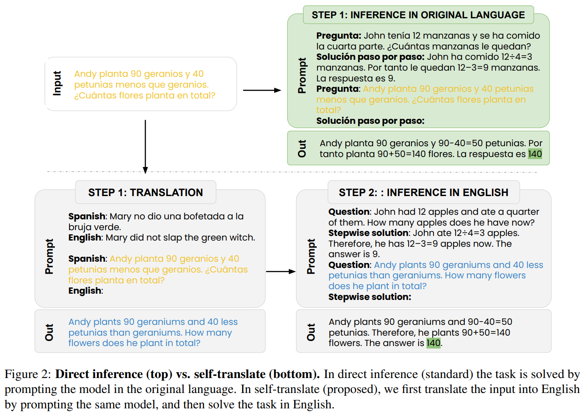
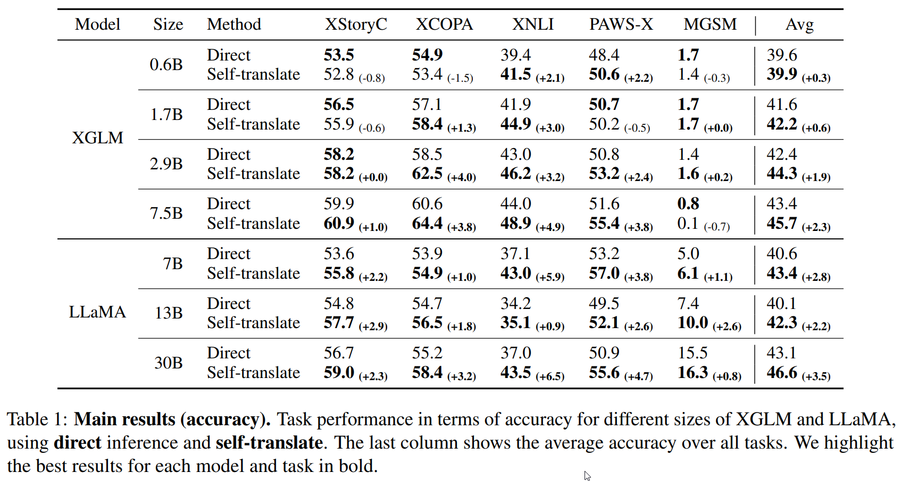
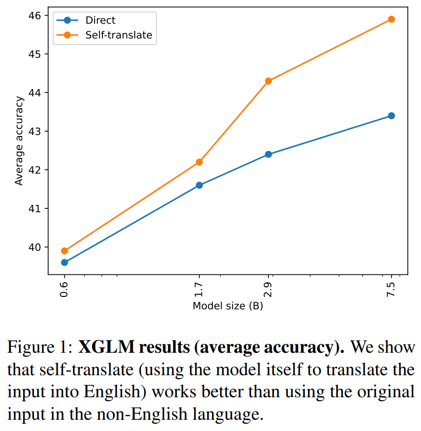
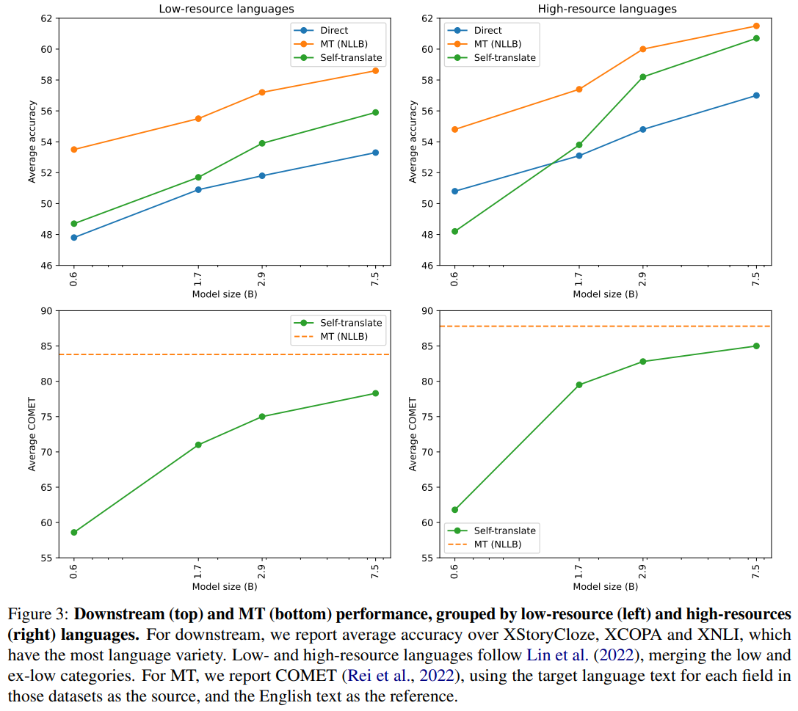

# Do Multilingual Language Models Think Better in English?

Multilingual LMs show impressive capabilities on many tasks, but the performance for non-English languages is much lower. Translate-test is a successful technique that improves results, but it is not clear whether the improvements come from external data or whether the models inherently prefer English to solve the tasks. In this work, we introduce a self-translate method that uses the multilingual model itself to translate into English before solving the task. We perform evaluations on 5 common multilingual tasks that involve some kind of reasoning, and test our method on many models of different architectures and sizes. We show that our method consistently improves performance, and that the gap is bigger for models with higher capabilities. Our results suggest that language processing and task solving are coupled to some extent in multilingual language models.

## Methods

As shown in Figure 2, we compare two methods for each model: **direct** inference, where we feed the original (non-English) input to the model, and **self-translate**, where we first translate the input into English using the model itself, and then feed this translated input to the same model to solve the task. For analysis, we additionally
compare self-translate to using an external state-of-
the-art **MT** system.



## Install

Start by cloning the repository:

```bash
git clone https://github.com/juletx/self-translate
cd self-translate
```

You can create a virtual environment and install the requirements:

```bash
python -m venv venv
source venv/bin/activate
pip install -r requirements.txt
```

You will need to install [LM Evaluation Harness](https://github.com/EleutherAI/lm-evaluation-harness) for evaluation in the `lm_eval` folder. To evaluate with the `self-translate` and `mt` methods, you will need to install our fork of LM Evaluation Harness:

```bash
cd lm_eval
git clone -b translation https://github.com/juletx/lm-evaluation-harness
cd lm-evaluation-harness
pip install -e .
```

## Translation

We use the HuggingFace Transformers to translate the datasets. Translation scripts are in the `translate` directory. There is a folder for each model with the translation scripts that were used to generate the results in the paper. The resulting translated datasets are available in HuggingFace: https://huggingface.co/juletxara.

- The script `dataset.py` contains the dataset classes.
- The script `dataset_configs.py` contains the configuration for each dataset.
- We use the `translate_dataset_nllb.py` script to translate the datasets with NLLB. This script uses the `translate.py` script to translate each field of the dataset.
- The `translate_dataset_few_shot.py` script is used to translate the datasets with XGLM. This script uses the `translate_few_shot.py` script to translate each field of the dataset.

To evaluate translations, run the `evaluate_translations.py` script in the `evaluation` folder. This scripts computes BLEU, COMET and chrf++ metrics for each model and dataset. Metrics are already available in the `metrics` folder. There is a notebook that can be used to generate the plots and tables in the paper.

### Self-translate

For example, to translate the XStoryCloze dataset to English using XGLM 7.5B, run:

```bash
accelerate launch --mixed_precision fp16 translate_dataset_few_shot.py \
--dataset xstory_cloze \
--target_lang "eng_Latn" \
--starting_batch_size 128 \
--model_name "facebook/xglm-7.5B" \
--max_length 1024 \
--max_new_tokens 64 \
--num_beams 1 \
--num_return_sequences 1 \
--precision fp16 \
--eos_token "</s>"
```

### MT

For example, to translate the XStoryCloze dataset to English using NLLB-200-3.3B, run:

```bash
accelerate launch --mixed_precision fp16 translate_dataset_nllb.py \
--dataset xstory_cloze \
--target_lang "eng_Latn" \
--starting_batch_size 1536 \
--model_name "facebook/nllb-200-3.3B" \
--max_length 64 \
--num_beams 1 \
--num_return_sequences 1 \
--precision fp16
```

## Evaluation

For evaluation we use LM Evaluation Harness. The scripts are in the `lm_eval/scripts` folder. There is a folder for each model with the evaluation scripts that were used to generate the results in the paper. There is also a `results` folder with the results of the evaluation for each model and dataset. Finally, there is a notebook that can be used to generate the plots and tables in the paper.

For each model there are scripts to evaluate using the three different methods: direct, self-translate and MT.

For example, this is the script to evaluate XGLM model on each dataset using self-translate:

```bash
# xglm model names
model_names=(
    "facebook/xglm-564M"
    "facebook/xglm-1.7B"
    "facebook/xglm-2.9B"
    "facebook/xglm-4.5B"
    "facebook/xglm-7.5B"
)

# select tasks
tasks_selected=(
    "xcopa-mt"
    "xstory_cloze-mt"
    "pawsx-mt"
    "xnli-mt"
)

num_fewshot=0

for model_name in "${model_names[@]}"; do
    for group_name in "${tasks_selected[@]}"; do
        python3 ../../lm-evaluation-harness/main.py \
            --model hf-causal-experimental \
            --model_args pretrained=$model_name,use_accelerate=True \
            --tasks ${group_name}_${model_name:9}_* \
            --device cuda \
            --output_path ../../results/xglm/${model_name:9}/${model_name:9}_${group_name}-few-shot_${num_fewshot}-shot.json \
            --batch_size auto \
            --no_cache \
            --num_fewshot ${num_fewshot}
    done
done
```

## Results

Table 1 reports our main results, and Figure 1 visualizes the average accuracy of XGLM as a function of scale. Figure 3 compares the downstream performance and translation quality of self-translate and NLLB, grouped by low-resource and high-resource languages. As shown in Figure 1, we find that self-translate works better than solving the task directly in the original language. This demonstrates that multilingual language models are unable to leverage their full potential when prompted in non-English languages.





